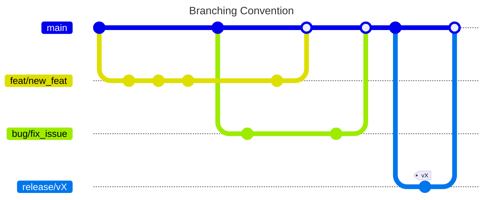
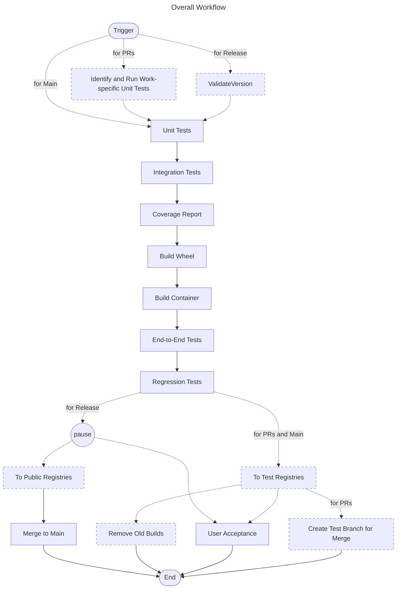
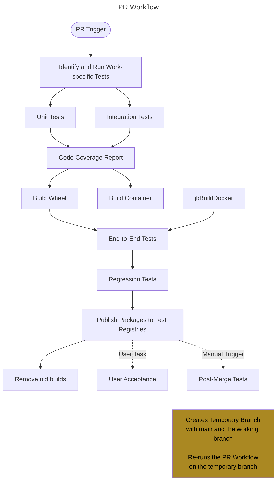
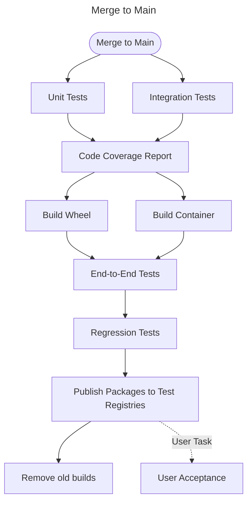
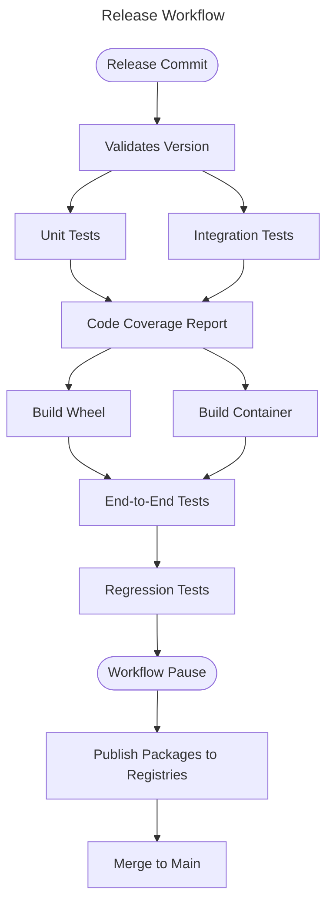

# Syntrend CI Workflow

The overall branching convention uses Trunk-based development as this is releasing versioned products to external registries.

This requires that:

1. Each Feature and Bug being merged to `main` must by production ready.
2. Release Branches are created to...
  * allow cherry-picking of features/bugs to be included in a release.
  * isolate in-depth Release and UA Tests from an active `main` branch.

## Branch Rules and Workflows

### Pull Requests

Should include everything necessary for the changes are production ready and can be included in a release.

> [!NOTE]
> Objectives:
> 
> * includes unit/integration/end-to-end tests specific to the work being done
> * ensures no breaking changes to existing capabilities
> * ensures no breaking changes after a merge to main (through a temporary branch with both branches)
> * can build a package and pushed to the target registries (as test builds)
> * passes all tests (end-to-end tests all performed on both Wheel and Docker builds)

### Merge to Main

Repeats a lot of the some tests and functions done with PRs, but only focuses on production-readiness.

> [!NOTE]
> Objectives:
> 
> * includes unit/integration/end-to-end tests specific to the work being done
> * ensures no breaking changes to existing capabilities
> * can build a package and pushed to the target registries (as test builds)
> * passes all tests (end-to-end tests all performed on both Wheel and Docker builds)

### Release Branch

Taking the work merged into `main`, the release branch will focus on combining the cherry-picked features from `main` and preparing any documentation and release notes.

Should include everything necessary for the changes are production ready and can be included in a release.

> [!NOTE]
> Objectives:
> 
> * includes unit/integration/end-to-end tests specific to the work being done
> * ensures no breaking changes to existing capabilities
> * ensures no breaking changes after a merge to main (through a temporary branch with both branches)
> * can build a package and pushed to the target registries (as test builds)
> * passes all tests (end-to-end tests all performed on both Wheel and Docker builds)
                                 

> [!NOTE]
> The last task (Merge to Main) is completed so 
> any bug fixes or corrections are made 
> available for all future releases.
