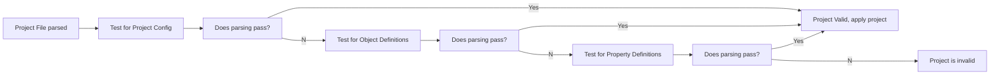

# Project File Properties

This document will share how to build up a project file with it's associated properties. If more information is required, a property will refer to a topic-specific document to explain how the properties can affect a result.

## Parsing the Project File

The settings below define how a project file is structured. This also allows flexibility to improve a compact structure. The way a project file is parsed is by running multiple passes to determine what the project contains.

These passes are defined as:

1. Project File contains a [Project Config](#project-config) with known keys at the file's root level.
2. Project file contains a set of [Object Definitions](#object-definitions) where the keys at the root level are the object names
3. Project file contains the set of [Property Definitions](#property-definitions) as the file only contains a single object with name `this`.

## Project Setup and Outputs

### Project Config

Root-Level configuration for project files.

* **objects**: Mapping of [Object Definitions](#object-definitions)
* **output**: Default properties to define how and where results are generated found in [Output Config](#output-config)
* **config**: Syntrend configuration properties to modify tool behaviour under [Module Config](#module-config)

### Output Config

Configuration Properties used for Global and Object-specific outputs

* **format**: Output Format Type (default: `json`)
* **directory**: Path of output directory if writing to files
* **filename_format**: String Format of output files (default: `{name}_{id}.{format}`)
* **collection**: Boolean if all sequential values is a single collection (default: False)
* **count**: Count of records to generate (default: 1)
* **time_field**: Name of embedded property containing a time value. Supports record simulations if generating values at specific time intervals related to the time in the record.

### Module Config

Configuration Properties to modify/alter how the `syntrend` utility behaves

* **max_generator_retries**: Maximum number of retries a Generator can perform before failing (default: 20)
* **max_historian_buffer**: Maximum values to be kept in a buffer of previous values (default: 20)
* **generator_dir**: Source Directory of Custom Generators for the project
* **formatter_dir**: Source Directory of Custom Formatters for the project

## Object Definitions

### Property Definition

Definition of how a value is generated and any associated properties to modify its behaviour

* **type**: Generator Type to be used for this Property Definition
* **distribution**: Property to define how the generated values will vary using a [Distribution Type](#distribution-Types). Defaults to "none" (defined as a [Property Distribution](#property-distribution)).
* **expression**: String Expression to define a trend, behaviour, or conditions to apply.

  > [!NOTE]
  > For more information on Expressions, see [Expressions](expressions.md).

* **start**: Any static value associated with a relevant `type` for when a previous value is expected but none available.
* **items**: List of items required for Generator Types needing a list of objects to choose from.
* **properties**: Mapping of sub properties namely to support nested objects. Commonly used for `object` types.

### Object Definition

Extended definition of [Property Definitions](#property-definition) to support root-level object behaviour.

Contains all of the same properties as [Property Definitions](#property-definition) with the inclusion of the following properties:

* **output**: Object-specific [Output Configuration](#output-config) that will supersede any default or project-level values.

### Property Distribution

Configurations to support how values will vary from its original value.

Distributions are one of:

* `none`: No distribution is applied to generated values along a trend
* `linear`: A random distribution applied linearly between a minimum and maximum range is applied.
* `std_dev`: A random distribution applied by a standard deviation along the generated value trend.

> [!NOTE]
> More details about Value Distribution can be found under [Distributions](distributions.md).

* **type**: The type of distribution to apply. Defaults to "none"
* **std_dev**: The standard deviation of the distribution (if using a `std_dev` distribution)
* **min_offset**: The minimum offset of the distribution
* **max_offset**: The maximum offset of the distribution

## Environment Variables

* **SYNTREND_MAX_GENERATOR_RETRIES**: Sets value for `max_generator_retries` in the Project-level [Module Config](#module-config).
* **SYNTREND_MAX_HISTORIAN_BUFFER**: Sets value for `max_historian_buffer` in the Project-level [Module Config](#module-config).
* **SYNTREND_GENERATOR_DIR**: Sets value for `generator_dir` in the Project-level [Module Config](#module-config)
* **SYNTREND_FORMATTER_DIR**: Sets value for `formatter_dir` in the Project-level [Module Config](#module-config)
