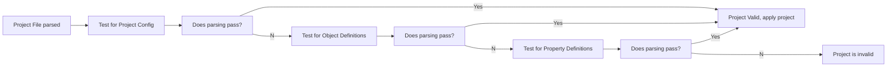

# Project File Properties

This document will share how to build up a project file with it's associated properties. If more information is required, a property will refer to a topic-specific document to explain how the properties can affect a result.

## Parsing the Project File

The settings below define how a project file is structured. This also allows flexibility to improve a compact structure. The way a project file is parsed is by running multiple passes to determine what the project contains.

These passes are defined as:

1. Project File contains a [Project Config](#project-config) with known keys at the file's root level.
2. Project file contains a set of [Object Definitions](#object-definitions) where the keys at the root level are the object names
3. Project file contains the set of [Property Definitions](#property-definitions) as the file only contains a single object with name `this`.

## Project Setup and Outputs

### Project Config

Root-Level configuration for project files.

| Property    | Default | Description                                                                                               |
|-------------|---------|-----------------------------------------------------------------------------------------------------------|
| **objects** | -       | Mapping of [Object Definitions](#object-definitions)                                                      |
| **output**  | {}      | Default properties to define how and where results are generated found in [Output Config](#output-config) |
| **config**  | {}      | Syntrend configuration properties to modify tool behaviour under [Module Config](#module-config)          |

### Output Config

Configuration Properties used for Global and Object-specific outputs

| Property                      | Default              | Description                                                                                                                                                      |
|-------------------------------|----------------------|------------------------------------------------------------------------------------------------------------------------------------------------------------------|
| **format**                    | json                 | Output Format Type (see [Output Formats](outputs.md) for options)                                                                                                |
| **directory**                 | -                    | Path of output directory if writing to files. If empty, output is written to console.                                                                            |
| **filename_format**           | {name}_{id}.{format} | String Format of output files. For more information, see [Filename Format Template](#filename-format-template)                                                   |
| **collection**                | false                | Boolean if all sequential values is a single collection                                                                                                          |
| **count**                     | 1                    | Count of records to generate                                                                                                                                     |
| **time_field**                | -                    | Name of embedded property containing a time value. Supports record simulations if generating values at specific time intervals related to the time in the record |

#### Conditional Properties

These properties are useful for specific Formatters or Output Targets.

| Property                      | Condition       | Default | Description                                                                                                              |
|-------------------------------|-----------------|---------|--------------------------------------------------------------------------------------------------------------------------|
| **console_collection_format** | `directory: ""` | {body}  | A display format to display a collection dataset. See more in [Console Output Formats](#console-output-formats).         |
| **console_event_format**      | `directory: ""` | {body}  | A display format to display an event dataset. See more in [Console Output Formats](#console-output-formats).             |
| **header_separator**          | `format: table` | "="     | Character seperating the header row from the table body (see more in [Table Formatting](outputs.md#ascii-table))         |
| **column_separator**          | `format: table` | " "     | Character between columns of the table. Any string will be used (see more in [Table Formatting](outputs.md#ascii-table)) |
| **row_separator**             | `format: table` | ""      | Character between table records (see more in [Table Formatting](outputs.md#ascii-table))                                 |

#### Filename Format Template

Filenames are defined by a template string using variable placeholders to construct the filename as it would be written to the `directory` path.

Possible placeholder variables include:

| Variable   | Description                               |
|------------|-------------------------------------------|
| **name**   | The object name as defined in the project |
| **id**     | The iteration of the specific output where `count` is greater than one. If using a single output or using `collection`, only a single output will be created with `id` equal "0". |
| **format** | The filename format and will use the `output.type` value as the extension. |

> [!NOTE]
> Other placeholders are possible. Please add a [Feature Request](https://github.com/wsidl/syntrend/issues) for new placeholders.

### Console Output Formats

Related to the discussion in [Output Formats to console](outputs.md#console), **Collections** and **Events** need to share a common space. As such, it is possible to define some unique ways to display them.

> [!IMPORTANT]
> All outputs naturally include a newline separator between outputs.

This format is defined using variable placeholders and by default uses `{body}` for all outputs. Additional placeholders listed below.

| Variable   | Description                                             |
|------------|---------------------------------------------------------|
| **name**   | Name of the object being displayed.                     |
| **body**   | Content of the formatted dataset.                       |
| **buffer** | Spaced buffer to provide based on the length of `name`. |
| **nl**     | OS-specific newline character.                          |

### Module Config

Configuration Properties to modify/alter how the `syntrend` utility behaves

| Property                  | Default | Description                                                      |
|---------------------------|---------|------------------------------------------------------------------|
| **max_generator_retries** | 20      | Maximum number of retries a Generator can perform before failing |
| **max_historian_buffer**  | 20      | Maximum values to be kept in a buffer of previous values         |
| **generator_dir**         | -       | Source Directory of Custom Generators for the project            |
| **formatter_dir**         | -       | Source Directory of Custom Formatters for the project            |

## Object Definitions

### Property Definition

Definition of how a value is generated and any associated properties to modify its behaviour

| Property         | Default      | Description                                                                                                                                                                                |
|------------------|--------------|--------------------------------------------------------------------------------------------------------------------------------------------------------------------------------------------|
| **type**         | (required)   | Generator Type to be used for this Property Definition                                                                                                                                     |
| **distribution** | {type: none} | Property to define how the generated values will vary using a [Distribution Type](#distribution-Types). Defaults to "none" (defined as a [Property Distribution](#property-distribution)). |
| **expression**   | -            | String Expression to define a trend, behaviour, or conditions to apply. For more information on Expressions, see [Expressions](expressions.md).                                            |
| **items**        | []           | List of items required for Generator Types needing a list of objects to choose from.                                                                                                       |
| **properties**   | {}           | Mapping of sub properties namely to support nested objects. Commonly used for `object` types.                                                                                              |

### Object Definition

> [!IMPORTANT]
> Extended definition of [Property Definitions](#property-definition) to support root-level object behaviour.

Contains all of the same properties as [Property Definitions](#property-definition) with the inclusion of the following properties:

| Property   | Default | Description                                                                                                     |
|------------|---------|-----------------------------------------------------------------------------------------------------------------|
| **output** | {}      | Object-specific [Output Configuration](#output-config) that will supersede any default or project-level values. |

### Property Distribution

Configurations to support how values will vary from its original value.

| Distribution Type | Description                                                                            |
|-------------------|----------------------------------------------------------------------------------------|
| `none`            | No distribution is applied to generated values along a trend                           |
| `linear`          | A random distribution applied linearly between a minimum and maximum range is applied. |
| `std_dev`         | A random distribution applied by a standard deviation along the generated value trend. |

> [!NOTE]
> More details about Value Distribution can be found under [Distributions](distributions.md).

Property Distribution object is defined by the following properties:

| Property         | Default | Description                                                           |
|------------------|---------|-----------------------------------------------------------------------|
| **type**         | none    | The type of distribution to apply                                     |
| **std_dev**      | 0       | The standard deviation of the distribution (if using `type: std_dev`) |
| **min_offset**   | 0       | The minimum offset of the distribution (if using `type: linear`)      |
| **max_offset**   | 1       | The maximum offset of the distribution (if using `type: linear`)      |

## Environment Variables

| Variable                           | Related Config                                   |
|------------------------------------|--------------------------------------------------|
| **SYNTREND_MAX_GENERATOR_RETRIES** | [`config.max_generator_retries`](#module-config) |
| **SYNTREND_MAX_HISTORIAN_BUFFER**  | [`config.max_historian_buffer`](#module-config)  |
| **SYNTREND_GENERATOR_DIR**         | [`config.generator_dir`](#module-config)         |
| **SYNTREND_FORMATTER_DIR**         | [`config.formatter_dir`](#module-config)         |
